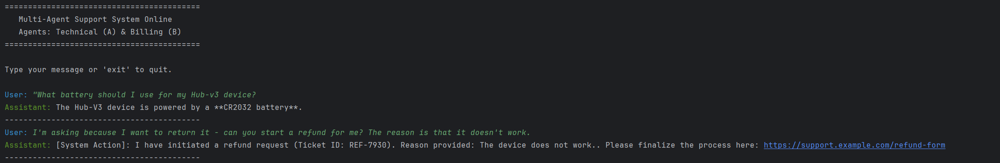
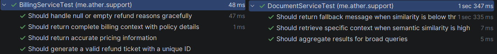

# AI Customer Support System - Multi-Agent & RAG Architecture

## Project Overview
A robust, Java-based multi-agent system designed for automated customer support. This project demonstrates a production-ready orchestration layer and specialized AI agents built from scratch using **Google Gemini 3 Flash**. 

Unlike standard implementations, this system avoids high-level abstractions like LangChain or Spring AI to showcase a deep understanding of LLM integration, prompt engineering, and vector-based information retrieval.

## Key Technical Features

### 1. Semantic RAG (Retrieval-Augmented Generation)
- **Vector Search Engine**: Implemented a custom retrieval system using **Cosine Similarity** to match user queries with internal documentation.
- **Embedding Integration**: Utilizes `text-embedding-004` to transform raw text into high-dimensional vectors, enabling semantic understanding beyond simple keyword matching.
- **Fact-Grounding**: Agent A (Technical Specialist) is strictly grounded in the provided knowledge base, preventing hallucinations for out-of-scope queries.

### 2. Multi-Agent Orchestration
- **Intent-Based Routing**: A central Orchestrator classifies user intent in real-time and dynamically switches context between specialized agents (Technical vs. Billing).
- **State Management**: Maintains conversation history across agent transitions to ensure a seamless user experience.

### 3. Automated Tool Calling
- **Action Execution**: Agent B (Billing) can trigger real-world actions, such as initiating refund tickets via the `BillingService`.
- **Validation logic**: Integrated defensive programming in service layers to validate inputs before processing sensitive financial operations.

## Tech Stack
- **Language**: Java 16 (OpenJDK)
- **Build Tool**: Maven
- **LLM**: Google Gemini 3 Flash
- **JSON Handling**: Google Gson
- **Testing**: JUnit 5, Mockito (for LLM and Service isolation)

## Project Structure
- `me.ather.support.service`: Core business logic (RAG engine, Billing operations, LLM Client).
- `me.ather.support.model`: Data structures (Records) for API communication and message history.
- `me.ather.support`: Main entry point and Agent Orchestrator.

## Demonstration & Sample Query

### Professional Conversation Flow
To see the system in action, try the following multi-turn query:

**Query:** > "I'm having trouble with my Hub-v3, what battery does it use? Also, the device arrived damaged, so I would like to request a refund."

**Expected System Behavior:**
1. **RAG Retrieval**: The system identifies the Hub-v3 hardware context and retrieves the "CR2032" battery specification.
2. **Intent Switching**: The Orchestrator detects the refund request and hands over the conversation to Agent B.
3. **Tool Execution**: Agent B triggers the `initiateRefund` tool, generating a unique Ticket ID (e.g., REF-4921).



## Quality Assurance

The project includes a comprehensive test suite to ensure the reliability of the semantic search and billing logic.

### Unit Testing Strategy
- **Service Isolation**: Used **Mockito** to mock LLM responses, allowing for deterministic testing of the RAG retrieval logic without API costs or latency.
- **Edge Case Coverage**: Validated threshold-based search failures and empty input handling in financial tools.



## Setup & Running

1. **Set API Key**:
   ```bash
   export GEMINI_API_KEY=your_api_key
   ```
   
2. ***Run tests***:
   ```bash
   mvn test
   ```
   
3. ***Run apliccation:
   ```bash
   mvn clean compile exec:java
   ```

