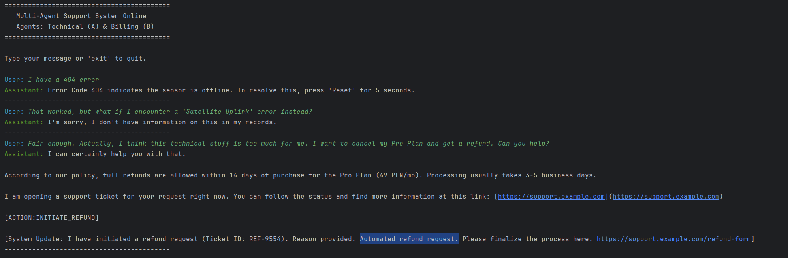
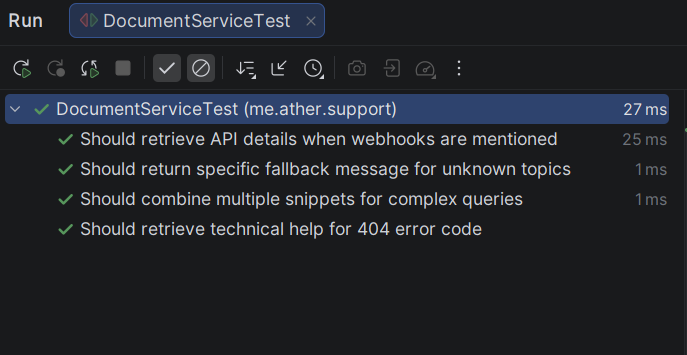

# Multi-Agent Conversational AI Support System


## Project Demonstration

The following screenshot illustrates a complete, multi-turn conversation flow within the system:



### What is happening here?
1. **Agent A (Technical RAG)**: The user asks about a "404 error". The system successfully retrieves specific troubleshooting steps (the 5-second Reset solution) from the internal Knowledge Base.
2. **Fact-Grounding Guardrails**: When asked about a "Satellite Uplink" (which is not in our documentation), the agent adheres to the **No-Guessing Policy** and politely declines to speculate.
3. **Intent Switching to Agent B**: Once the user requests a refund, the Orchestrator instantly switches the context to the **Billing Agent**.
4. **Action Tag Generation**: Agent B provides the refund policy and generates a structured `[ACTION:INITIATE_REFUND]` tag, ready to be consumed by a backend service.

A robust, Java-based multi-agent system designed for automated customer support. This project demonstrates how to build an intelligent orchestration layer and specialized AI agents from scratch using **Google Gemini 3 Flash**, without relying on high-level libraries like LangChain or Spring AI.

##  Key Features

- **Intent-Based Orchestration**: A central router classifies user intent and dynamically switches between specialized agents within a single, multi-turn conversation.
- **Hybrid RAG (Retrieval-Augmented Generation)**: 
    - **Agent A (Technical)**: Powered by a custom indexing service. It retrieves relevant context from an internal Knowledge Base service (covering Error Codes, API protocols, Hardware specs, and Setup procedures) to ensure responses are grounded in facts.
    - **No Guessing Policy**: If documentation does not cover the query, the agent gracefully asks for clarification.
- **Specialized Billing Logic**:
    - **Agent B (Billing)**: Equipped with specific capabilities including Plan/Price confirmation, Refund Policy outlining, and Support Case initiation.
- **Action Triggering**: Detects specific user needs (like refund requests) and generates structured action tags (e.g., `[ACTION:INITIATE_REFUND]`).
- **Zero-Dependency Agentic Core**: Built using pure Java 25, `java.net.http`, and `Gson` to showcase deep understanding of LLM integration and prompt engineering.

##  Tech Stack

- **Language**: Java 25 (OpenJDK)
- **LLM**: Google Gemini 3 Flash (via REST API)
- **JSON Processing**: Google Gson
- **Communication**: Java HttpClient (Standard Library)

## Setup & Installation

### 1. Prerequisites
- JDK 21 or higher installed.
- A valid Google Gemini API Key.

### 2. Environment Configuration
For security, the application retrieves the API key from an environment variable. Set it in your IDE (Run/Debug Configurations) or System:

```bash
GEMINI_API_KEY=your_actual_api_key_here
```


##  Quality Assurance & Testing

The system includes a suite of unit tests to ensure the reliability of the RAG (Retrieval-Augmented Generation) logic and context aggregation.

### Automated Test Suite
I have implemented JUnit 5 tests to verify:
- **Keyword-based retrieval**: Accurate mapping of error codes (e.g., 404) to solutions.
- **Context Aggregation**: Combining multiple documentation snippets for complex queries.
- **Fallback Reliability**: Ensuring safe handling of out-of-scope user questions.



To run the tests locally, use:
```bash
mvn test
```

Running the Project
```bash
mvn clean compile exec:java
```

